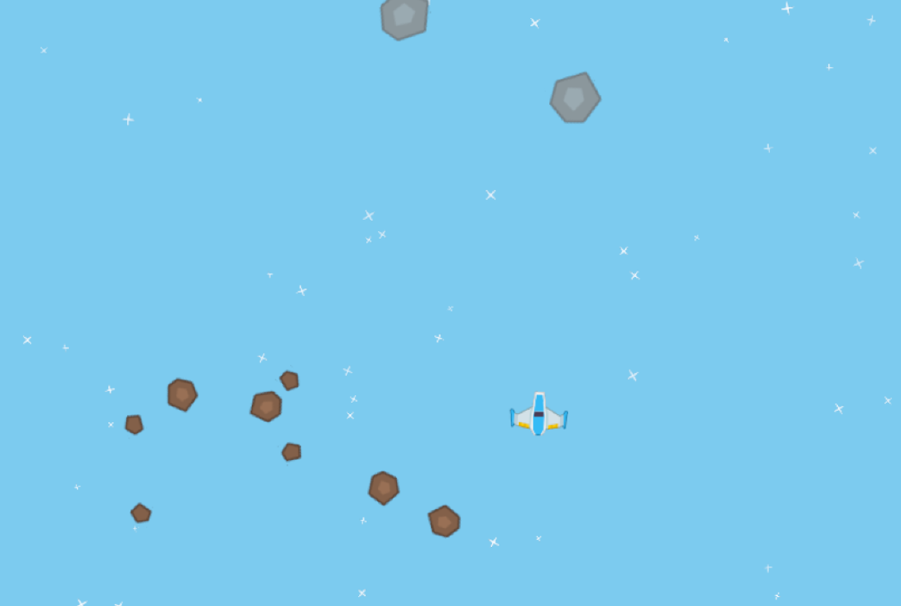
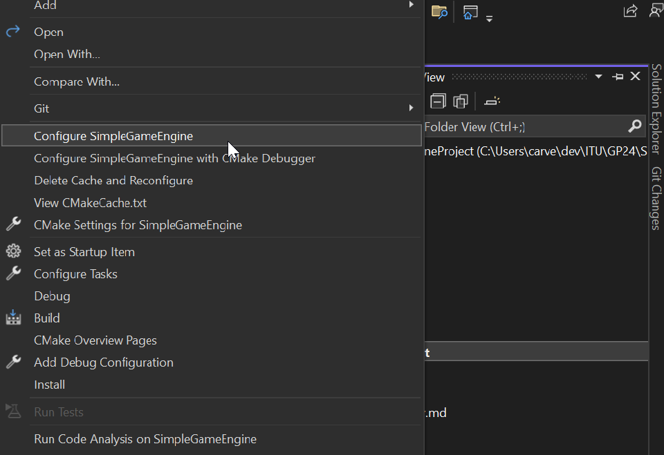

# Exercise 4

## Setup
- Move te exercise folder folder inside SimpleRenderEngineProject
- Add submission folder as subdirectory at the end of `SimpleRenderEngineProject/CMakeLists.txt`
```
# ...

### misc
mark_as_advanced(
	SDL2MAIN_LIBRARY
)


# add this here
add_subdirectory(GameProgramming24/Exercise4)

```



## 4.1
Create a sprite sheet using [Texture Packer](www.codeandweb.com/texturepacker) (Free) using the
sprites found in the Sprites directory. You will need sprites for SpaceShip, Asteroids/Meteors (3 sizes), Laser, and a bang. (Use the settings described in [include/sre/SpriteAtlas.hpp](www.codeandweb.com/texturepacker))
https://github.com/mortennobel/SimpleRenderEngine/blob/master/include/sre/SpriteAtlas.hpp

Create a single sprite sheet (asteroids.png + asteroids.json) which contains all sprites used in the game. This should replace the current sprite sheet. (the spritesheet files should go in `ExampleGame/data`)

After updating the file, run CMake again.


## 4.2
Create the Player
- Should render with a spaceshit
- Controls:
	- W:   move forward
	- A/D: rotate left/right
	- Spacebar: shoot laser
- If the spaceship is out of the screen bounds, it should warp to the other side of the screen
  (remember the obstacles in Froggers)

## 4.3
Create the Asteroids
- Has a constant rotation and a constant velocity. The rotation and
velocity should have a random value upon creation.
- Asteroids should exist in 3 sizes (optional)
- When the game starts then add 5 large asteroids on a random position.

## 4.4
Create the Laser
- Should move slow (to be visible)
- Should fire when space is pressed in the direction that the spaceship is facing
from the position of the spaceship.
- Laser should be destroyed after 1 second

## 4.5
Detect collisions between lasers, spaceship and asteroids.
Implement the following behavior:
- If a laser hit anything it should be destroyed
- If an asteroid is hit by a laser it should be replaced by two smaller
asteroids. If the asteroid is the smallest size, then it should disappear.
Whenever the asteroid is hit, the score should be incremented by one.
- If an asteroid hits a spaceship the player dies and the Bang sign should
be shown instead of the spaceship. The game should now restart when
space-key is pressed.