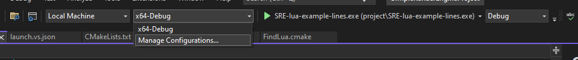
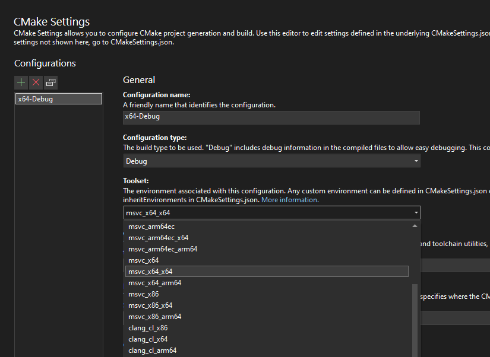
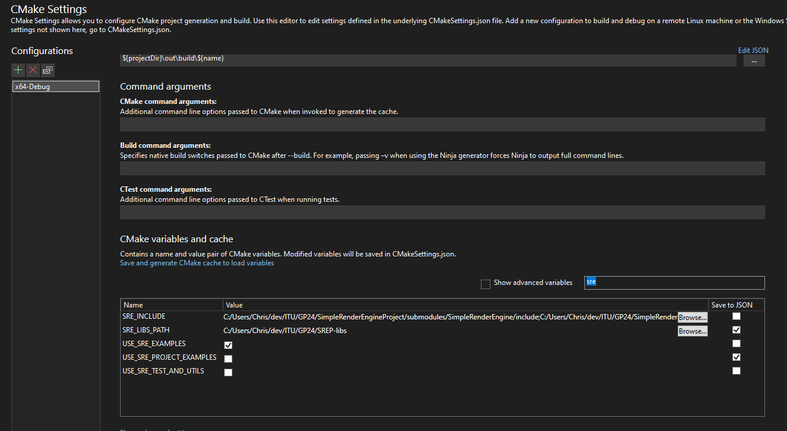

# SimpleRenderEngine Projects

This is a fork of SimpleRenderEngine including libraries and bindings to common game development libraries. (This includes SimpleRenderEngine dependencies)
The goal of this project is be able to get started without spending time on setup.

First clone the project (`git clone --recurse-submodules https://github.com/mortennobel/SimpleRenderEngineProject.git`). You can use of the examples as starting point.

For more information about SimpleRenderEngine see:

https://github.com/mortennobel/SimpleRenderEngine

# Setup
- open the fodler in VisualStudio
- select `Manage Configurations` in the configuration list

- check that the current architecture matches your current system. **NB: only x64 supported at this time!**

- set the `SRE_LIBS_PATH` variable to the path containing the project's dependencies.

# Current Known Limitations
- only Windows x64 supported at the time